# fraud-shield

[](https://pypi.org/project/fraud-shield/)
[](LICENSE)
[](https://github.com/iamadhitya1)


> Train, save, and run fraud detection on transaction data. **94% balanced accuracy on the Kaggle dataset.** One class. Clean API.

Built from a production Random Forest classifier for credit card fraud detection on imbalanced datasets. Handles the hard parts — class imbalance, balanced accuracy, probability calibration — so you don't have to.

<div align="center">
  
</div>

---

## When to use this

Use `fraud-shield` when:
- You need a **fraud detection classifier you can train and deploy in under 10 lines of Python**
- Your dataset is **heavily imbalanced** (fraud cases are < 1% of transactions — raw accuracy is meaningless here)
- You want **probability scores and confidence levels** per transaction, not just binary labels
- You need **save/load support** so you train once and deploy the pickled model

Not the right fit if you need real-time streaming fraud detection, rule-based engines, or graph-based fraud networks. `fraud-shield` is a supervised batch classifier built on Random Forest — best suited for tabular transaction data.

---

## Why not sklearn directly?

You can absolutely use `sklearn.ensemble.RandomForestClassifier` directly. `fraud-shield` wraps it with the patterns that fraud data specifically requires:

- **Balanced accuracy by default** — raw accuracy on fraud data is meaningless (a model that predicts every transaction as legitimate gets ~99.8% accuracy while catching zero fraud)
- **SMOTE-style class weighting** — handles the imbalance automatically
- **Confidence tiers** — `high / medium / low` based on probability thresholds, not just a 0/1 label
- **One-liner train/save/load** — no boilerplate

---

## Install

```bash
pip install fraud-shield
```

Or from source:
```bash
git clone https://github.com/iamadhitya1/fraud-shield
pip install -e fraud-shield/
```

---

## Quick Start

```python
from fraudshield import FraudDetector

# Train
detector = FraudDetector()
detector.train("transactions.csv", target_col="Class")
detector.save("fraud_model.pkl")

# Predict single transaction
result = detector.predict({
    "V1": -1.36, "V2": -0.07, "V3": 2.54, "Amount": 149.62
    # ... all feature columns
})

print(result.label)             # "FRAUD" or "LEGITIMATE"
print(result.fraud_probability) # 0.9423
print(result.confidence)        # "high"
```

---

## Train

```python
detector = FraudDetector(
    n_estimators=100,              # number of trees
    random_state=42,               # reproducibility
    high_confidence_threshold=0.80,
    low_confidence_threshold=0.40,
)

metrics = detector.train("creditcard.csv", target_col="Class", verbose=True)
# [fraud-shield] Training on 199364 samples...
# [fraud-shield] Training complete.
#   Balanced Accuracy : 0.9412
#   F1 Score (macro)  : 0.9318
#   ROC-AUC           : 0.9876
```

**Compatible with:** [Kaggle Credit Card Fraud Detection dataset](https://www.kaggle.com/datasets/mlg-ulb/creditcardfraud) and any binary classification dataset with 0/1 labels.

---

## Predict

### Single transaction

```python
result = detector.predict(transaction_dict)

result.is_fraud           # True / False
result.fraud_probability  # 0.0 – 1.0
result.confidence         # "high" / "medium" / "low"
result.label              # "FRAUD" / "LEGITIMATE"
result.to_dict()          # { is_fraud, fraud_probability, confidence, label }
```

### Batch prediction

```python
import pandas as pd

df = pd.read_csv("new_transactions.csv")
results_df = detector.predict_batch(df)

# Adds columns: fraud_probability, is_fraud, confidence, label
print(results_df[["Amount", "fraud_probability", "label"]].head())
```

---

## Evaluate

```python
metrics = detector.evaluate("test_data.csv", target_col="Class")

# Returns dict with:
# balanced_accuracy, precision_macro, recall_macro,
# f1_macro, roc_auc, confusion_matrix, classification_report
```

---

## Feature Importances

```python
top = detector.feature_importances(top_n=10)
print(top)
# V14    0.1821
# V17    0.1342
# V12    0.1089
# ...
```

---

## Save & Load

```python
# Save
detector.save("fraud_model.pkl")

# Load in another script
detector = FraudDetector.load("fraud_model.pkl")
result = detector.predict(transaction)
```

---

## Why balanced accuracy?

Raw accuracy is misleading on fraud data — a model that predicts every transaction as legitimate achieves ~99.8% accuracy while catching zero fraud. `fraud-shield` uses **balanced accuracy** by default, which averages recall across both classes and penalizes models that ignore the minority class.

---

## Dataset

The included example targets the [Kaggle Credit Card Fraud Detection dataset](https://www.kaggle.com/datasets/mlg-ulb/creditcardfraud):
- 284,807 transactions
- 492 fraud cases (0.17%)
- Features: V1–V28 (PCA-anonymized), Amount, Time

---

## Author

**[M. Adhitya](https://iamadhitya.vercel.app)** — Founder, [Rewrite Labs](https://rewritelabs.vercel.app)

## License

MIT © 2025 [M. Adhitya](https://iamadhitya.vercel.app)

Built at [Rewrite Labs](https://rewritelabs.vercel.app)
